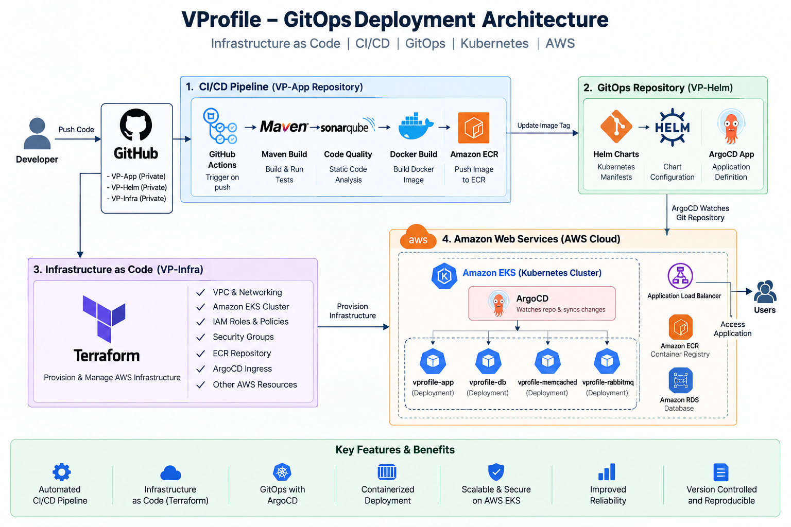

# 🚀 VProfile GitOps Deployment Platform

A production-style **DevOps and GitOps deployment platform** for deploying a Java-based VProfile application on **Amazon EKS** using Terraform, Docker, Kubernetes, Helm, ArgoCD, GitHub Actions, SonarQube and Amazon ECR.

---

## 📌 Project Overview

This project implements an end-to-end **CI/CD and GitOps workflow** for a containerized Java application running on AWS.

The project combines **Infrastructure as Code, Continuous Integration, Containerization, Kubernetes orchestration and GitOps-based Continuous Deployment** into a single automated deployment workflow.

The implementation is divided into three repositories:

- **VP-App** → Application source code and CI pipeline
- **VP-Infra** → AWS infrastructure using Terraform
- **VP-Helm** → Kubernetes, Helm and ArgoCD deployment configuration

The complete workflow is:

```text
Developer
    │
    ▼
  GitHub
    │
    ▼
GitHub Actions
    │
    ├── Maven Build
    ├── SonarQube Analysis
    ├── Docker Build
    └── Docker Push
            │
            ▼
        Amazon ECR
            │
            ▼
      Update Image Tag
            │
            ▼
         VP-Helm
            │
            ▼
          ArgoCD
            │
            ▼
        Amazon EKS
            │
            ▼
    Kubernetes Workloads
            │
            ▼
     Running Application
```

---

## 🏗️ Architecture

The architecture diagram below represents the complete **CI/CD, Infrastructure as Code and GitOps workflow**.



### 📁 Architecture Diagram Location

```text
architecture/
└── architecture.png
```

> Make sure the architecture image is saved exactly as `architecture/architecture.png` inside the repository so GitHub can display it automatically.

---

## 🛠️ Tech Stack

### ☁️ Cloud

- Amazon Web Services (AWS)
- Amazon EKS
- Amazon ECR
- Amazon RDS
- IAM
- VPC
- Security Groups
- AWS Load Balancer / Ingress

### ⚙️ DevOps

- Git
- GitHub
- GitHub Actions
- CI/CD
- Docker
- Maven
- SonarQube
- Terraform

### ☸️ Kubernetes & GitOps

- Kubernetes
- Helm
- ArgoCD
- Kubernetes Ingress

### 💻 Programming

- Java

---

## ✨ Features

- Automated CI/CD Pipeline
- Infrastructure as Code using Terraform
- Docker Containerization
- Automated Docker Image Build
- Amazon ECR Container Registry
- Amazon EKS Kubernetes Deployment
- Helm-based Application Deployment
- GitOps using ArgoCD
- Continuous Kubernetes Synchronization
- SonarQube Code Quality Analysis
- Automated Application Delivery
- Version-Controlled Infrastructure
- Declarative Deployment Configuration
- Cloud-based Application Hosting
- Kubernetes Ingress for Application Access

---

## 🔄 Project Workflow

1. Developer pushes application code to GitHub.
2. GitHub Actions automatically triggers the CI pipeline.
3. Maven builds the Java application.
4. SonarQube performs static code analysis.
5. Docker builds the application container image.
6. The Docker image is pushed to Amazon ECR.
7. The deployment configuration is updated with the new image tag.
8. ArgoCD monitors the GitOps repository.
9. ArgoCD detects the change in the desired state.
10. ArgoCD synchronizes the Kubernetes resources.
11. Amazon EKS updates the application workload.
12. The updated application becomes available through the configured ingress/load balancer.

---

## 🔁 CI/CD Pipeline

```text
Developer
    │
    ▼
  GitHub
    │
    ▼
GitHub Actions
    │
    ├── Maven Build
    │
    ├── SonarQube Analysis
    │
    ├── Docker Build
    │
    └── Docker Push
            │
            ▼
        Amazon ECR
```

### 🔹 CI Pipeline Stages

### 1. Source Control

Application source code is maintained in Git and stored in GitHub.

### 2. Maven Build

Maven is used for:

- Dependency management
- Compilation
- Testing
- Application packaging

### 3. SonarQube Analysis

SonarQube is integrated into the CI pipeline for static code analysis and code quality monitoring.

### 4. Docker Build

The application is packaged into a Docker image to provide a consistent runtime environment.

### 5. Amazon ECR

The generated Docker image is pushed to **Amazon Elastic Container Registry (ECR)**.

### 6. Image Tag Update

The deployment configuration is updated with the new container image tag so that the GitOps deployment can use the newly built image.

---

## 🔁 GitOps Workflow

The deployment side of the project follows the **GitOps model**.

```text
             Git Repository
                    │
                    │ Desired State
                    ▼
                 ArgoCD
                    │
                    │ Reconciliation
                    ▼
               Amazon EKS
                    │
                    ▼
           Kubernetes Workloads
                    │
                    ▼
                Application
```

Git acts as the **source of truth** for the desired application deployment state.

ArgoCD continuously monitors the GitOps repository and synchronizes the Kubernetes cluster with the configuration stored in Git.

### GitOps Benefits

- Version-controlled deployments
- Declarative application configuration
- Automated synchronization
- Easier rollback
- Improved deployment visibility
- Reduced manual intervention

---

## ☸️ Kubernetes Deployment

The application is deployed on **Amazon EKS using Kubernetes**.

Example workloads:

```text
Amazon EKS
│
├── VProfile Application
├── Database
├── Memcached
└── RabbitMQ
```

The Kubernetes configuration is maintained using Kubernetes manifests and Helm charts.

---

## ⛵ Helm

Helm is used to package and manage the application's Kubernetes configuration.

### Example structure

```text
helm/
└── vprofile/
    │
    ├── Chart.yaml
    ├── values.yaml
    │
    └── templates/
        ├── deployment.yaml
        ├── service.yaml
        └── ...
```

### Helm provides

- Reusable Kubernetes configuration
- Parameterized deployments
- Simplified application configuration
- Version-controlled deployment templates
- Easier Kubernetes resource management

---

## 🔄 ArgoCD

ArgoCD is used as the **GitOps Continuous Delivery tool**.

```text
VP-Helm
   │
   │ Watches Git Repository
   ▼
ArgoCD
   │
   │ Synchronizes
   ▼
Amazon EKS
```

ArgoCD continuously checks the desired state stored in Git and reconciles the Kubernetes cluster with that configuration.

### ArgoCD Responsibilities

- Monitor GitOps repository
- Detect configuration changes
- Synchronize Kubernetes resources
- Maintain desired application state
- Provide deployment visibility
- Enable Git-based deployment management

---

## 🏗️ Infrastructure as Code

Terraform is used to provision and manage AWS infrastructure.

```text
Terraform Code
      │
      ▼
Terraform Plan
      │
      ▼
Terraform Apply
      │
      ▼
AWS Infrastructure
```

### Terraform manages infrastructure such as

- Amazon EKS
- AWS networking
- IAM roles and policies
- Security configuration
- Amazon ECR
- Ingress-related infrastructure
- Supporting cloud resources

---

## 📂 Terraform Structure

```text
terraform/
│
├── main.tf
├── variables.tf
├── outputs.tf
├── backend.tf
├── iam_policy.json
└── argocd-ingress.yaml
```

### 📄 File Responsibilities

| File | Purpose |
|---|---|
| `main.tf` | Main infrastructure resources |
| `variables.tf` | Configurable Terraform variables |
| `outputs.tf` | Terraform output values |
| `backend.tf` | Terraform backend/state configuration |
| `iam_policy.json` | IAM policy configuration |
| `argocd-ingress.yaml` | ArgoCD ingress configuration |

---

## 📦 Repository Structure

The complete implementation is logically divided into three repositories.

```text
GitOps Project
│
├── VP-App
│   ├── .github/
│   │   └── workflows/
│   ├── Docker-files/
│   ├── src/
│   ├── pom.xml
│   └── sonar-project.properties
│
├── VP-Infra
│   ├── main.tf
│   ├── variables.tf
│   ├── outputs.tf
│   ├── backend.tf
│   ├── iam_policy.json
│   └── argocd-ingress.yaml
│
└── VP-Helm
    ├── argocd/
    ├── helm/
    │   └── vprofile/
    └── kubedefs/
```

---

## 🔗 Repository Responsibilities

### 📁 VP-App

Contains:

- Java application
- Maven configuration
- GitHub Actions workflow
- Docker configuration
- SonarQube configuration

### Workflow

```text
Java Application
      │
      ▼
    Maven
      │
      ▼
  SonarQube
      │
      ▼
    Docker
      │
      ▼
  Amazon ECR
```

---

### 📁 VP-Infra

Contains Terraform-based infrastructure configuration.

### Workflow

```text
Terraform
    │
    ▼
AWS Resources
    │
    ▼
Amazon EKS
```

---

### 📁 VP-Helm

Contains:

- Helm charts
- Kubernetes manifests
- ArgoCD configuration

### Workflow

```text
Helm + Kubernetes
        │
        ▼
      ArgoCD
        │
        ▼
    Amazon EKS
```

---

## ☁️ AWS Services Used

| AWS Service | Purpose |
|---|---|
| Amazon EKS | Kubernetes cluster for application deployment |
| Amazon ECR | Container image registry |
| Amazon RDS | Managed database |
| IAM | Access control and permissions |
| VPC | Network isolation |
| Security Groups | Network traffic control |
| Load Balancer | Application traffic routing |

---

## 🐳 Containerization

Docker is used to package the Java application together with its runtime requirements.

```text
Application Source
       │
       ▼
    Maven Build
       │
       ▼
   Docker Build
       │
       ▼
  Docker Image
       │
       ▼
    Amazon ECR
       │
       ▼
    Amazon EKS
```

The same application image can then be deployed consistently through the Kubernetes environment.

---

## 🌐 Application Access

Application traffic is routed through Kubernetes ingress and AWS load-balancing infrastructure.

```text
Users
  │
  ▼
Load Balancer
  │
  ▼
Kubernetes Ingress
  │
  ▼
VProfile Service
  │
  ▼
VProfile Application
```

---

## 🔐 Security

Security-related configuration is handled using AWS IAM, networking controls and restricted access to cloud resources.

### Security Practices

- IAM-based access control
- Security Groups for network filtering
- Private credentials kept outside source control
- Git-based configuration management
- Controlled Kubernetes access
- Sensitive configuration excluded from the public repository

---


## 📊 Complete Deployment Flow

```text
                     DEVELOPER
                         │
                         ▼
                       GitHub
                         │
                         ▼
                 GitHub Actions
                         │
              ┌──────────┼──────────┐
              │          │          │
              ▼          ▼          ▼
           Maven     SonarQube    Docker
           Build      Analysis     Build
                                     │
                                     ▼
                                Amazon ECR
                                     │
                                     ▼
                                  Image Tag
                                     │
                                     ▼
                                   VP-Helm
                                     │
                                     ▼
                                   ArgoCD
                                     │
                                     ▼
                                Amazon EKS
                                     │
                                     ▼
                              Kubernetes Pods
                                     │
                                     ▼
                                Application
```

---

## 🌱 Infrastructure Flow

```text
             VP-Infra
                 │
                 ▼
              Terraform
                 │
                 ▼
           AWS Infrastructure
                 │
        ┌────────┼─────────┐
        │        │         │
        ▼        ▼         ▼
       EKS      ECR       IAM
        │
        ▼
    Kubernetes
```

---

## 🧠 Key DevOps Concepts

This project demonstrates practical implementation of:

```text
Infrastructure as Code
        ↓
     Terraform
        ↓
AWS Infrastructure
        ↓
    Amazon EKS
        ↓
    Kubernetes
        ↓
       Helm
        ↓
      ArgoCD
        ↓
      GitOps
```

Alongside the Continuous Integration pipeline:

```text
Developer
    ↓
GitHub
    ↓
GitHub Actions
    ↓
Maven
    ↓
SonarQube
    ↓
Docker
    ↓
Amazon ECR
```

---

## ✨ Project Highlights

- End-to-End DevOps Implementation
- Infrastructure as Code with Terraform
- AWS Cloud Deployment
- Amazon EKS Kubernetes Cluster
- Docker-based Application Containerization
- Automated CI using GitHub Actions
- Maven Build Automation
- SonarQube Integration
- Amazon ECR Container Registry
- Helm-based Kubernetes Deployment
- GitOps with ArgoCD
- Declarative Infrastructure
- Automated Application Delivery
- Version-Controlled Deployment Configuration
- Kubernetes Ingress
- IAM-based Access Management

---

## 🎓 Learning Outcomes

Through this project, I gained practical experience in:

- AWS Cloud Infrastructure
- Terraform
- Infrastructure as Code
- Amazon EKS
- Kubernetes
- Docker
- Amazon ECR
- Helm
- ArgoCD
- GitOps
- GitHub Actions
- CI/CD
- Maven
- SonarQube
- Kubernetes Networking
- IAM
- Cloud Deployment
- Containerized Application Deployment
- DevOps Automation

---

## 📈 Project Outcome

The final architecture provides a repeatable and automated path from source code to a running application on Kubernetes.

```text
Code
 ↓
CI Pipeline
 ↓
Container Image
 ↓
GitOps Configuration
 ↓
ArgoCD
 ↓
Amazon EKS
 ↓
Application
```

The project reduces manual deployment steps and keeps infrastructure and deployment configuration version controlled through Git.

---

## 🚀 Future Improvements

Possible future improvements include:

- Automated infrastructure deployment through CI/CD
- Terraform module restructuring
- Multi-environment deployments
- Automated security scanning
- Centralized monitoring and observability
- Prometheus and Grafana integration
- Automated rollback strategies
- Kubernetes resource optimization
- Secret management using AWS Secrets Manager
- Advanced deployment strategies such as Blue-Green or Canary deployments

---

## 📁 Showcase Repository Structure

```text
vprofile-gitops/
│
├── README.md
│
├── architecture/
│   └── architecture.png
│
├── terraform/
│   ├── main.tf
│   ├── variables.tf
│   ├── outputs.tf
│   ├── backend.tf
│   └── iam_policy.json
│
├── kubernetes/
│   └── ...
│
├── helm/
│   └── vprofile/
│       ├── Chart.yaml
│       ├── values.yaml
│       └── templates/
│
├── argocd/
│   └── ...
│
├── ci-cd/
│   ├── pipeline.yml
│   ├── Dockerfile
│   └── sonar-project.properties
│
└── screenshots/
    ├── github-actions.png
    ├── argocd.png
    ├── eks.png
    ├── ecr.png
    └── application.png
```

---

## 📌 Repository Separation

The implementation is divided into three logical repositories:

### VP-App

**Application + CI**

```text
Java
 ↓
Maven
 ↓
SonarQube
 ↓
Docker
 ↓
Amazon ECR
```

### VP-Infra

**Infrastructure as Code**

```text
Terraform
 ↓
AWS Infrastructure
 ↓
Amazon EKS
```

### VP-Helm

**GitOps / Continuous Delivery**

```text
Helm
 +
Kubernetes
 ↓
ArgoCD
 ↓
Amazon EKS
```

---

## 🔒 Public Repository Note

This repository is intended as a **technical showcase of the VProfile DevOps and GitOps implementation**.

Sensitive credentials, private keys, cloud credentials, Terraform state and other confidential configuration should not be committed to the repository.

The actual implementation is maintained across separate application, infrastructure and GitOps repositories.

---

## 👨‍💻 Author

### Abdullah Zahid

**B.Tech Computer Science Engineering**

Cloud & DevOps Enthusiast

### Areas of Interest

- AWS
- Cloud Computing
- DevOps
- Cloud Security
- Kubernetes
- Infrastructure as Code
- GitOps
- CI/CD
- Cloud-Native Technologies

---

## 📄 Resume Project Description

### VProfile GitOps Deployment Platform

**Tech Stack:** AWS, Terraform, Amazon EKS, Kubernetes, Docker, Helm, ArgoCD, GitHub Actions, Amazon ECR, Maven, SonarQube

- Designed a GitOps-based deployment platform for a Java application using **Terraform, Amazon EKS, Kubernetes, Helm and ArgoCD**, with Git as the source of truth for deployment configuration.
- Implemented an automated CI pipeline using **GitHub Actions, Maven, SonarQube, Docker and Amazon ECR** for application build, code analysis and container delivery.
- Provisioned and managed AWS infrastructure using **Terraform** and automated Kubernetes application synchronization through **ArgoCD**.

---

## ⭐ Technology Summary

```text
AWS
Terraform
Amazon EKS
Kubernetes
Docker
Amazon ECR
GitHub Actions
ArgoCD
Helm
Maven
SonarQube
Git
GitHub
```

---

## 🔗 End-to-End Project Flow

```text
Code
  ↓
GitHub
  ↓
GitHub Actions
  ↓
Maven
  ↓
SonarQube
  ↓
Docker
  ↓
Amazon ECR
  ↓
GitOps Repository
  ↓
ArgoCD
  ↓
Amazon EKS
  ↓
Kubernetes
  ↓
VProfile Application
```

---

## ⭐ Project Summary

This project demonstrates the integration of **AWS, Terraform, Docker, Kubernetes, Helm, ArgoCD and CI/CD automation** to create a complete GitOps-based application deployment workflow.

It brings together:

**Infrastructure as Code + CI/CD + Containerization + Kubernetes + GitOps**

into one end-to-end cloud deployment platform.

---

## ⭐ If you found this project useful

Feel free to explore the repository and the implementation of the CI/CD, Infrastructure as Code and GitOps workflow.

---
